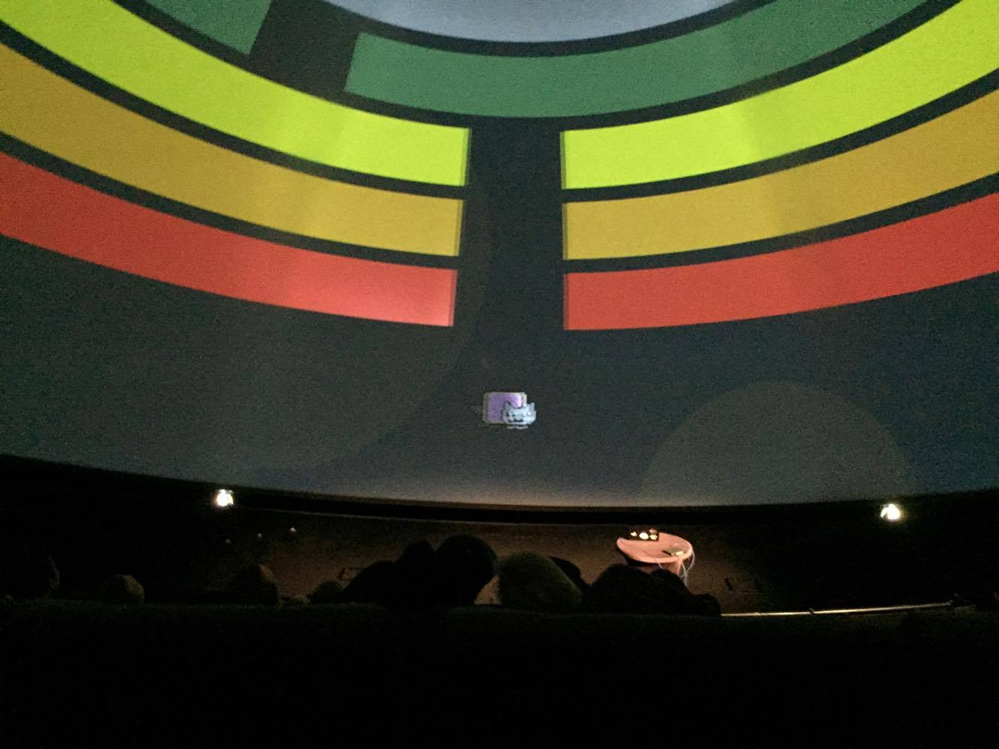

# Rainbone

_Rainbone_ is a voice-controlled game, developed for the dome theater in the Visualiseringscenter C. It is an interactive and immersive experience that engages the entire audience.

The game can be played as a single player, but also of several hundred players cooperating. Help the cat to get through the maze so it can reach its gift. Then Rick will take care of the rest.

Movie from the beta test in the dome coming soon. Stay tuned!

## Status

- Production-ready beta version, `v0.3-beta`, released.

## [setup](docs/setup.md)

## [gameplay instructions](docs/gameplay-instructions.md)
